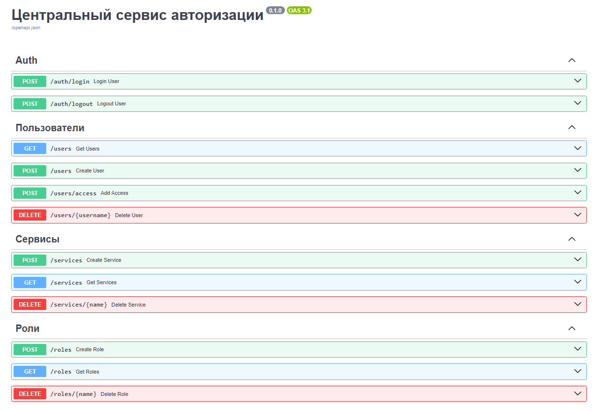

# О сервисе
Цель сервиса - центральный сервис авторизации, выдает jwt токен при авторизации, позволяет выполнять операции CRUD над пользователями.
# Запуск сервиса
1. Заполнить `.env`
2. Установить `poetry`
3. Создать виртуальное окружение и установить зависимости
4. Запустить миграции в терминале с помощью `poetry run alembic upgrade head`
5. Запустить сервис с помощью `poetry run uvicorn src.main:app`
# Документация

# Важно
С запуском сервиса создается пользователь `supersu` с ролью `admin` в сервисе `auth`. Пароль для пользователя указывается в `.env`. Под этим пользователем можно создавать других пользователей и выдавать им доступ в сервисы.
